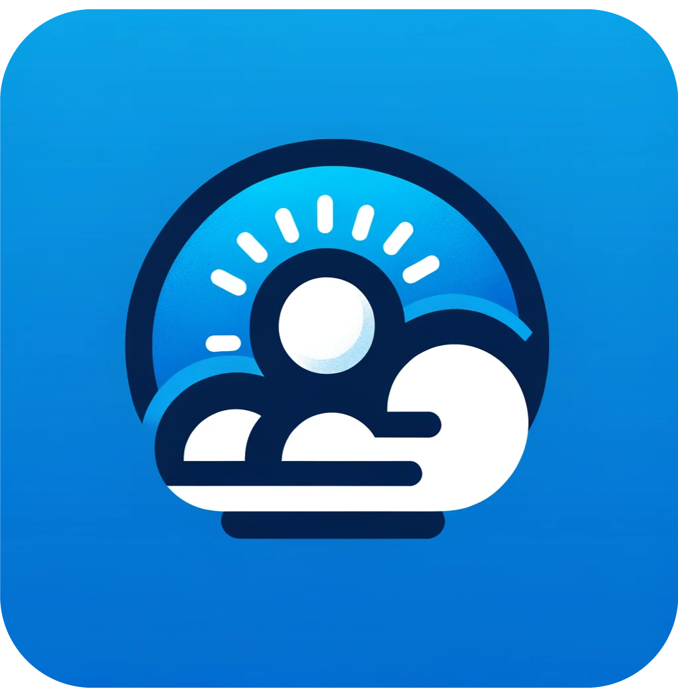
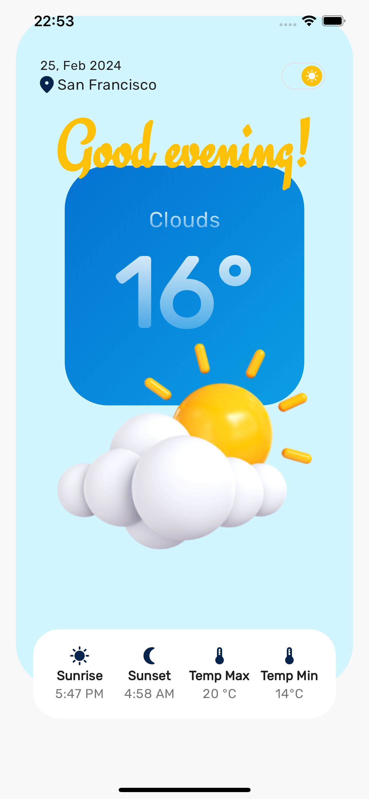
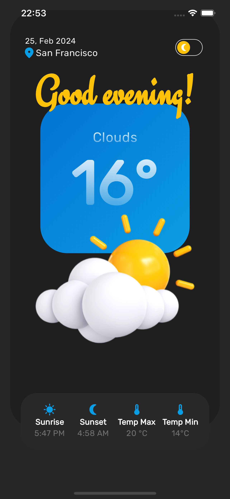

# Flutter Weather App Clean Architecture


The Weather App is a Flutter application that shows weather information based on the user's location and the current date/time. This application has been developed for learning new concepts in Flutter and at the same time reinforcing Domain-Driven Design (DDD), Clean Architecture, and testing processes. The application offers support in two languages (English and Turkish) and allows users to switch between dark and light themes according to their preferences.

## Features

- **Location-Based Weather:** Real-time weather information based on the user's current location.
- **Current Date and Time:** Date and time information that is dynamically updated according to the user's current location.
- **Two Language Support:** The application automatically adapts to the language settings of the user's device, offering support in two languages, English or Turkish.
- **Dark and Light Theme Options:** Allows users to easily switch between dark and light themes according to their visual preferences.
- **Clean Architecture:** The application has been developed using a layered structure and clearly defining the responsibility of each layer.
- **Domain-Driven Design (DDD):** Business logic and application flow are organized around domain models, resulting in a cleaner and more manageable code structure.
- **Testing Processes:** The application is supported by comprehensive tests to develop quality and reliable software. With Unit and BLoC tests, every aspect of the application is checked. Unit tests confirm the accuracy of functions, while BLoC tests verify the appropriateness of business logic and state management.

## Preview

<table>
  <tr>
    <td>Light Mode</td>
    <td>Dark Mode</td>
  </tr>
  <tr>
     <td></td>
     <td></td>
  </tr>
</table>

## Architecture

- This app is developed with [Clean Architecture](https://github.com/ResoCoder/flutter-tdd-clean-architecture-course#readme).

## Folder Structure

```sh
[lib]
│
├── [app]
│   ├── [constants]
│   ├── [env]
│   ├── [initializer]
│   ├── [l10n]
│   └── [theme]
│       ├── [colorscheme]
│       ├── [cubit]
│       ├── [dark]
│       └── [light]
│
├── [core]
│   ├── [clients]
│   │   └── [network]
│   ├── [enums]
│   ├── [error]
│   ├── [services]
│   └── [utils]
│       └── [extension]
│
└── [features]
    └── [home]
        ├── [data]
        │   ├── [datasources]
        │   ├── [model]
        │   └── [repositories]
        ├── [domain]
        │   ├── [entities]
        │   ├── [repositories]
        │   └── [usecases]
        └── [presentation]
            ├── [bloc]
            ├── [view]
            └── [widgets]
```

## Packages

### Dependencies Overview

- Networking
  - [Dio](https://pub.dev/packages/dio)
  - [PrettyDioLogger](https://pub.dev/packages/pretty_dio_logger)
  - [DioSmartRetry](https://pub.dev/packages/dio_smart_retry)
- Location
  - [Geolocator](https://pub.dev/packages/geolocator)
- State Management
  - [Bloc](https://pub.dev/packages/flutter_bloc)
- UI
  - [Google Fonts](https://pub.dev/packages/google_fonts)
  - [Cupertino Icons](https://pub.dev/packages/cupertino_icons)
  - [Flutter ScreenUtil](https://pub.dev/packages/flutter_screenutil)
  - [Flutter SVG](https://pub.dev/packages/flutter_svg)
- Utility
  - [Dartz](https://pub.dev/packages/dartz)
  - [Equatable](https://pub.dev/packages/equatable)
  - [Intl](https://pub.dev/packages/intl)
  - [Envied](https://pub.dev/packages/envied)
  - [Path Provider](https://pub.dev/packages/path_provider)
- Dependency Injection
  - [GetIt](https://pub.dev/packages/get_it)
- JsonParsing
  - [JSON Annotation](https://pub.dev/packages/json_annotation)
- Caching
  - [HydratedBloc](https://pub.dev/packages/hydrated_bloc)
- Localization
  - [EasyLocalization](https://pub.dev/packages/easy_localization)

### Development Dependencies

- Linter
  - [Very Good Analysis](https://pub.dev/packages/very_good_analysis)
- Testing
  - [Mocktail](https://pub.dev/packages/mocktail)
  - [BlocTest](https://pub.dev/packages/bloc_test)
- Code Generation
  - [Build Runner](https://pub.dev/packages/build_runner)
  - [JSON Serializable](https://pub.dev/packages/json_serializable)
  - [Envied Generator](https://pub.dev/packages/envied_generator)

## How to Use

##### Step 1:

Download or clone this repo by using the link below:

```sh
git clone https://github.com/nebiberke/flutter_weather_app.git
```

##### Step 2:

Go to project root and execute the following command in console to get the required dependencies:

```sh
flutter pub get
```

##### Step 3:

Place your own api key in the api key section found in the env/.env file.:

```sh
API_KEY = 'YOUR_API_KEY'
```

##### Step 4:

Execute the following scripts to generate files:

```sh
sh scripts/build_runner.sh
sh scripts/localization.sh
```

##### Step 4:

Run the project
